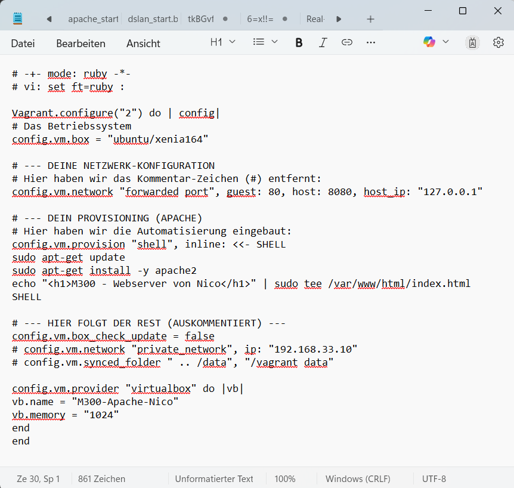
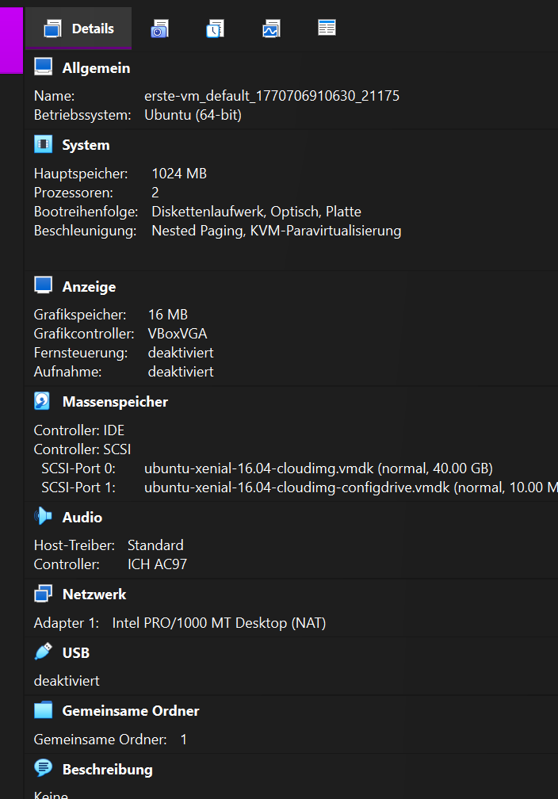

# Deployment-Prozess und Systemvalidierung

## 1. Initialisierung der Umgebung

Zuerst wurde lokal die Verzeichnisstruktur m300-arbeit/erste-vm erstellt. Die Bereitstellung der virtuellen Infrastruktur erfolgte anschliessend über die Kommandozeile mittels folgender Schritte:

Verwendete Befehle im Terminal:

`vagrant init ubuntu/xenial64`: Erstellung des Vagrantfiles mit dem offiziellen Ubuntu-Image als Basis.
`vagrant up`: Automatischer Download und Einrichtung der Instanz in VirtualBox.
`vagrant ssh`: Aufbau des direkten Zugriffs auf die Linux-Shell der VM.

## 2. Visuelle und technische Kontrolle

Ein Abgleich mit der VirtualBox-GUI bestatigte, dass die VM korrekt registriert wurde und ohne Fehlermeldungen lauft.

Um sicherzustellen, dass die virtuelle Hardware den Erwartungen entspricht, wurden nach dem Verbindungsaufbau die Systemressourcen intern geprüft:

`df -h`: Überprüfung der Mount-Points und Kapazitaten des Dateisystems.
`free -m`: Validierung des zugewiesenen Arbeitsspeichers (RAM).

## 3. Automatisierung und Web-Service

Um den Webserver nicht manuell installieren zu müssen, wurde das Vagrantfile angepasst. Ein integriertes Shell-Skript übernimmt nun die automatische Installation und Konfiguration der Dienste beim Systemstart.

## 4. Abschliessende Verifizierung

Die Erfolgskontrolle belegt die korrekte Funktion der gesamten Kette: Nach dem Start der VM ist der Apache-Webserver über ein Port-Forwarding auf dem Host-Rechner unter http://localhost:8080 erreichbar. Dies bestatigt sowohl die erfolgreiche Provisionierung als auch die Netzwerk-Konfiguration.

