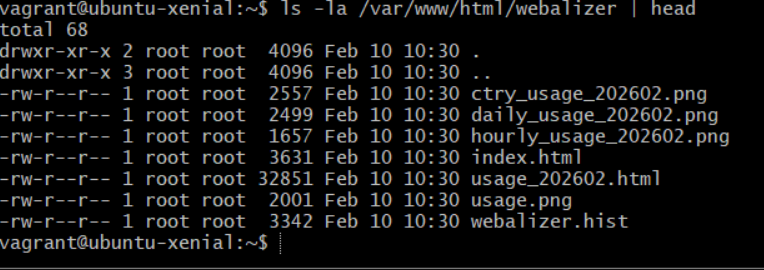
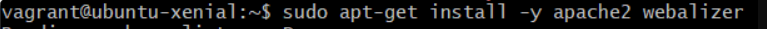
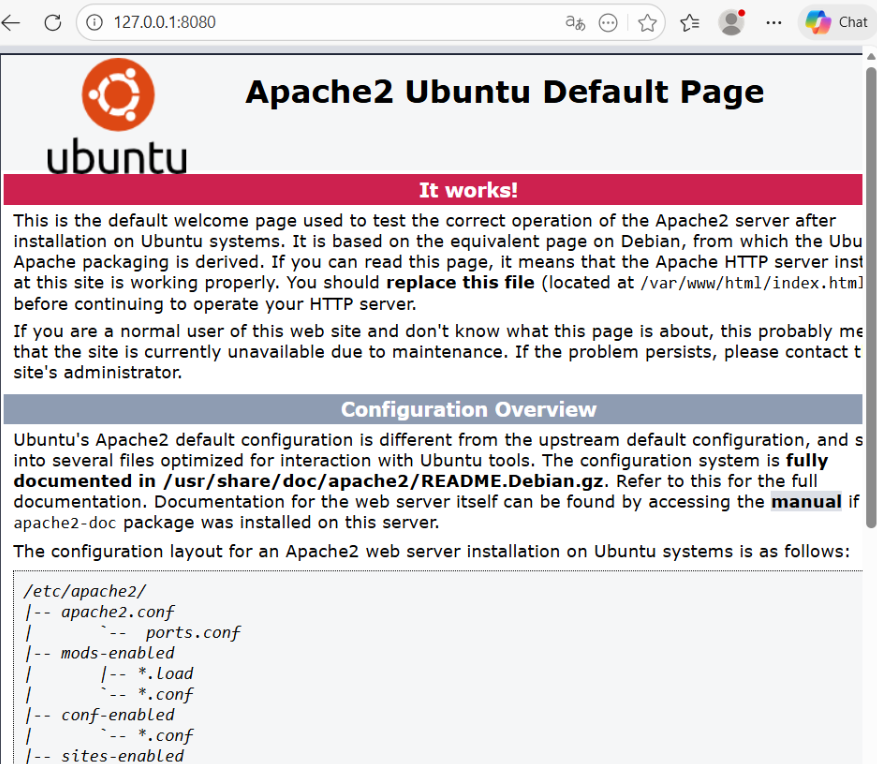

# M300-20 – Infrastruktur-Automatisierung

### 1. Initialisierung der dynamischen Plattform

Um eine lokale Private Cloud zu simulieren, wurde ein neues Arbeitsverzeichnis für die automatisierte Infrastruktur erstellt. Ziel war es, eine Umgebung zu schaffen, die On-demand und über Skripte steuerbar ist.

Verwendete Befehle im Terminal:

 `vagrant box add bento/ubuntu-16.04`: Hinzufügen einer vorkonfigurierten Basis-Box zur lokalen Registry.
 `vagrant init`: Erstellung des zentralen Vagrantfiles zur Definition der Infrastruktur.

### 2. Multi-Machine Konfiguration & Provisioning

Anstatt einer einfachen VM wurde ein komplexeres Szenario gewählt: Die Automatisierung eines Apache-Webservers mittels Shell-Provisioning. Hierbei wird die Software nicht mehr manuell installiert, sondern beim Boot-Vorgang durch Vagrant angewiesen.

Das automatisierte Setup (Vagrantfile):
Ich habe das Vagrantfile so konfiguriert, dass es Ressourcen (RAM/CPU) definiert, Ports weiterleitet und ein externes Installationsskript aufruft.

```ruby
Vagrant.configure("2") do |config|
  config.vm.define :webserver do |web|
    web.vm.box = "bento/ubuntu-16.04"
    web.vm.hostname = "srv-web-auto"
    # Port-Forwarding für den Webzugriff
    web.vm.network :forwarded_port, guest: 80, host: 8080
    # Automatische Installation via Shell-Skript
    web.vm.provision :shell, path: "install_apache.sh"
  end
end

```

### 3. Externe Provisionierung (Shell-Skript)

Um die Trennung von Infrastruktur-Definition und Software-Konfiguration sauber einzuhalten, wurde das Skript `install_apache.sh` erstellt:

```bash
#!/bin/bash
echo "Starte automatisierte Installation..."
sudo apt-get update
sudo apt-get -y install apache2
echo "Installation abgeschlossen."

```



---

## Validierung und Kontrolle

### Systemprüfung via CLI

Nach dem Ausführen von `vagrant up --provider virtualbox` wurde die VM instanziiert. Die korrekte Funktion der Automatisierung wurde wie folgt geprüft:

 Status-Check: `vagrant status` zeigt die laufende Instanz `webserver`.
 Ressourcen-Validierung: Via `vagrant ssh` wurden Speicherplatz (`df -h`) und RAM-Zuweisung (`free -m`) innerhalb der Cloud-Instanz kontrolliert.

### Netzwerkkontrolle (Success)

Dank des definierten Port-Forwardings konnte die erfolgreiche Bereitstellung der "Private Cloud" verifiziert werden. Der Webserver ist unter der lokalen Adresse des Laptops erreichbar, obwohl er isoliert in der automatisierten Umgebung läuft.

Ergebnis: `http://localhost:8080` zeigt die Apache-Standardseite.



---

## Reflexion zur Infrastruktur

Durch den Einsatz von Vagrant und Shell-Scripts wurde eine Dynamic Infrastructure Platform geschaffen, die:

1. Programmierbar ist: Die gesamte Umgebung existiert als Code.
2. On-demand funktioniert: Mit `vagrant destroy -f` und `vagrant up` lässt sich die Umgebung in Sekunden vernichten und identisch wiederherstellen.
3. Self-Service bietet: Ressourcenanpassungen (z.B. RAM) erfolgen nur durch eine Zeile im File.
