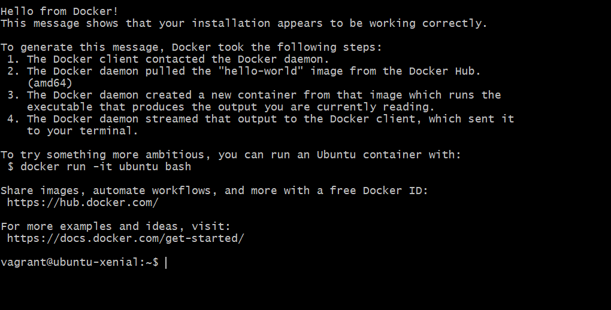

# M300 - 30 Container

## 1. Einführung in die Containerisierung

Container stellen eine fundamentale Änderung in der Softwareentwicklung dar, da sie Applikationen mitsamt allen Abhängigkeiten isolieren. Im Gegensatz zu virtuellen Maschinen teilen sich Container die Ressourcen direkt mit dem Host-Betriebssystem, was sie extrem leichtgewichtig und schnell startbar macht.

Ein wesentlicher Treiber für diese Technologie sind **Microservices**. Anstatt eines grossen Monolithen besteht das System aus kleinen, unabhängigen Komponenten, die über das Netzwerk kommunizieren und horizontal skaliert werden können.

## 2. Praktische Umsetzung mit Docker

Docker erweitert die Linux-Containertechnologie um portable Images und eine benutzerfreundliche Schnittstelle. Die Architektur basiert auf dem **Docker Daemon** (Verwaltung) und dem **Docker Client** (Bedienung via CLI).

### Initialisierung und Basisbefehle

Zuerst wurde die Docker-Umgebung innerhalb der Toolumgebung gestartet. Zur Verifizierung der Installation und zum Testen der Container-Steuerung wurden folgende Schritte durchgeführt:

Verwendete Befehle im Terminal:
`docker run hello-world`: Download und Ausführung eines Test-Containers zur Funktionsprüfung.
`docker ps -a`: Anzeige aller aktiven und beendeten Container auf dem System.
`docker images`: Auflistung aller lokal gespeicherten Container-Images.

### Erstellung eigener Images (Dockerfile)

Ein **Dockerfile** dient als Bauplan für neue Images. Jede Anweisung erzeugt eine neue Imageschicht (Layer).

Beispiel für ein Setup:
`docker build -t mein-webserver .`: Erstellung eines eigenen Images basierend auf den Instruktionen im Dockerfile.
`docker run -d -p 8080:80 mein-webserver`: Start des Containers im Hintergrund mit Port-Weiterleitung.

## 3. Persistenz und Netzwerk

Da Daten in Containern standardmässig beim Löschen verloren gehen, wurden **Volumes** implementiert, um Daten persistent auf dem Host zu speichern.

Netzwerkkonfiguration:
`docker network create isolated_nw`: Erstellung eines isolierten Bridge-Netzwerks für die interne Kommunikation zwischen Containern.
`docker network ls`: Überprüfung der verfügbaren Netzwerk-Treiber auf dem Host.

## 4. Image-Bereitstellung und Registry

Eigene Images können über den **Docker Hub** oder eine private Registry geteilt werden.

Verfahren zur Bereitstellung:
`docker tag mein-image username/mein-image`: Kennzeichnung des Images für den Upload.
`docker push username/mein-image`: Hochladen des Images in die Cloud-Registry.

## 5. Systemprüfung und Kontrolle

Zur Validierung der laufenden Container-Infrastruktur wurden folgende Diagnose-Befehle eingesetzt:

`docker inspect [container_id]`: Abfrage detaillierter Konfigurations- und Netzwerkeinstellungen.
`docker logs [container_id]`: Einsicht in die Standard-Ausgabe (Logs) des Prozesses innerhalb des Containers.

