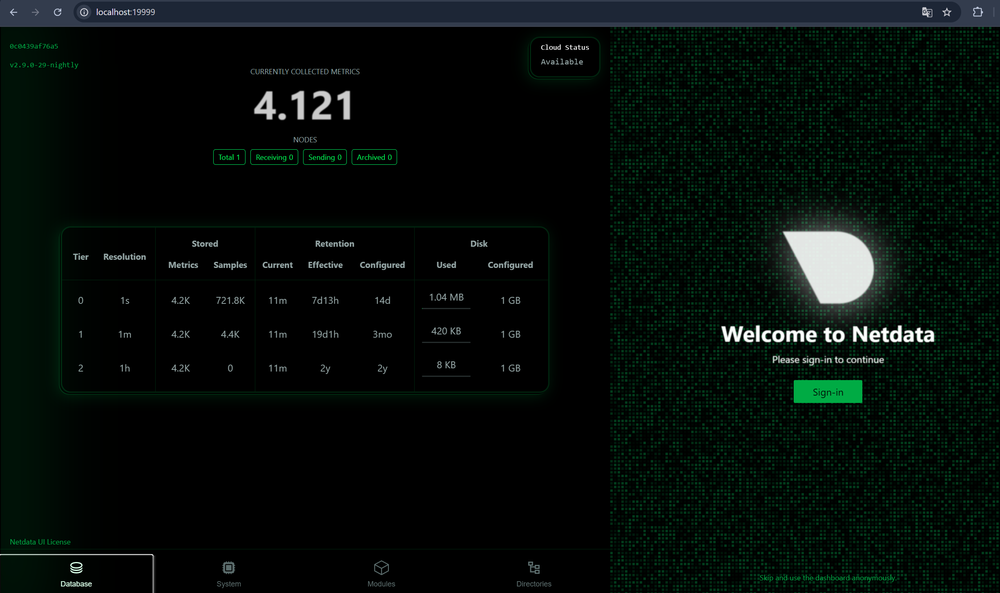
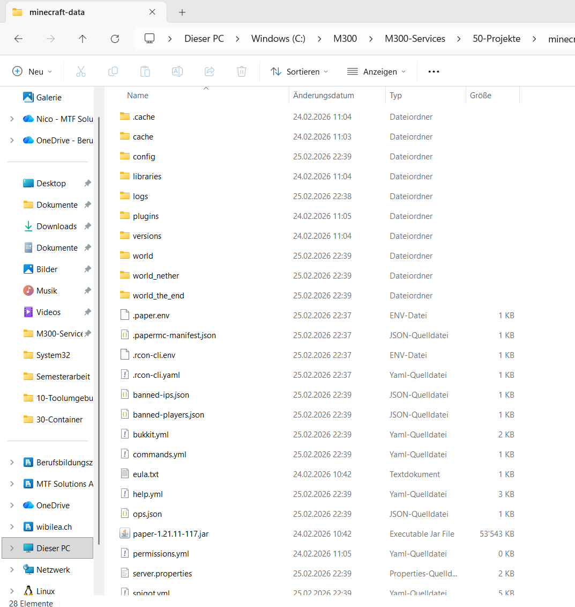
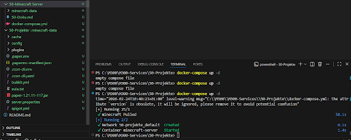
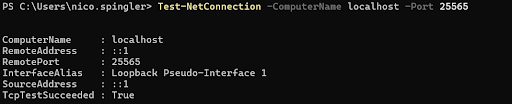

# Projektdokumentation M300: Minecraft-Server mit Docker & Netdata-Monitoring

## 1. Zweck des Services

Das Ziel meines Projekts war es, einen Minecraft-Server nicht einfach nur zu installieren, sondern professionell als Container-Dienstleistung bereitzustellen.

* **Zweck**: Betrieb einer isolierten Gaming-Instanz auf Basis der Paper-Engine.
* **Warum**: Durch Docker muss ich kein Java auf meinem Laptop installieren. Alles, was der Server braucht, ist im Image verpackt. Das macht das System sauber und ich kann den Server jederzeit löschen oder neu starten, ohne Spuren auf dem Host-System zu hinterlassen.

## 2. Aufbau und logische Struktur

Ich habe das Projekt so aufgebaut, dass es komplett über Code gesteuert wird (Infrastructure as Code).

* **Git/Quelle**: Ich nutze das bekannte Repository von `itzg`, um immer die aktuellsten Server-Dateien zu erhalten.
* **Vagrant**: Erstellt mir die virtuelle Maschine als Basis-Cloud.
* **Docker Compose**: Steuert zwei Container gleichzeitig – den Minecraft-Server und **Netdata**.
* **Netdata**: Dieses Tool habe ich hinzugefügt, um eine grafische Übersicht über die Auslastung (CPU, RAM) zu haben, die ich im Browser anschauen kann.

## 3. Konfiguration und Monitoring

Die Einrichtung lief fast komplett über die `docker-compose.yml`. Ich musste dort nur die EULA akzeptieren und die Version festlegen.

* **Monitoring**: Zur Überwachung nutze ich zwei Wege. Einmal klassisch über `docker stats` im Terminal für die schnellen Zahlen und für die grafische Analyse das **Netdata-Dashboard** auf Port 19999.
* **Ressourcen**: Ich habe dem Minecraft-Server 2GB RAM zugewiesen, damit er flüssig läuft.

## 4. Netzwerkverbindung und Ports

Damit ich mich verbinden kann, müssen die Ports von der VM nach aussen "geöffnet" werden.

* **Minecraft**: Port `25565` (TCP). Diesen habe ich im Vagrantfile und in Docker gemappt.
* **Netdata**: Port `19999`. Über diesen Port kann ich das Monitoring-Dashboard auf meinem Laptop aufrufen.

## 5. Host-Interaktion und Volumes

Container löschen ihre Daten normalerweise beim Stoppen. Da ich meine Minecraft-Welt aber behalten will, nutze ich Volumes.

* **Interaktion**: Ich habe den Ordner `./minecraft-data` auf meinem Laptop mit dem Container verknüpft.
* **Vorteil**: Wie man im VS Code Explorer sieht, liegen die Welt-Dateien und die `server.properties` direkt auf meinem Rechner. Ich kann also Backups machen oder Plugins hinzufügen, ohne in den Container "hineinzugehen".

## 6. Fehlerdokumentation (Troubleshooting)

Das war der wichtigste Teil, da am Anfang nicht alles direkt funktionierte:

* **Fehler 1: Leere Konfigurationsdatei**: Ich wollte den Server starten, aber die `docker-compose.yml` war noch leer oder im falschen Verzeichnis. Docker meldete `no configuration file provided`. Ich habe dann die Datei korrekt befüllt und gespeichert.

* **Fehler 2: VPN-Blockade**: Mein Netztest mit `Test-NetConnection` schlug fehl, obwohl der Container lief. Ich habe herausgefunden, dass mein **VPN** die Verbindung zu `localhost` gestört hat. Nachdem ich den VPN ausgeschaltet hatte, war die Verbindung erfolgreich (**TcpTestSucceeded: True**).

* **Fehler 3: EULA & Version**: Der Server brach den Start ab, weil die EULA nicht auf `TRUE` stand. Ausserdem gab es einen Mismatch bei der Version (1.21.1). Ich habe die Version dann fest in die YAML-Datei geschrieben, damit Client und Server zusammenpassen.
